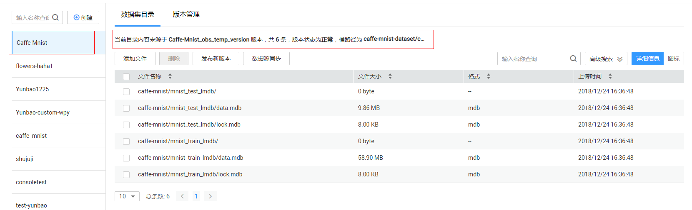
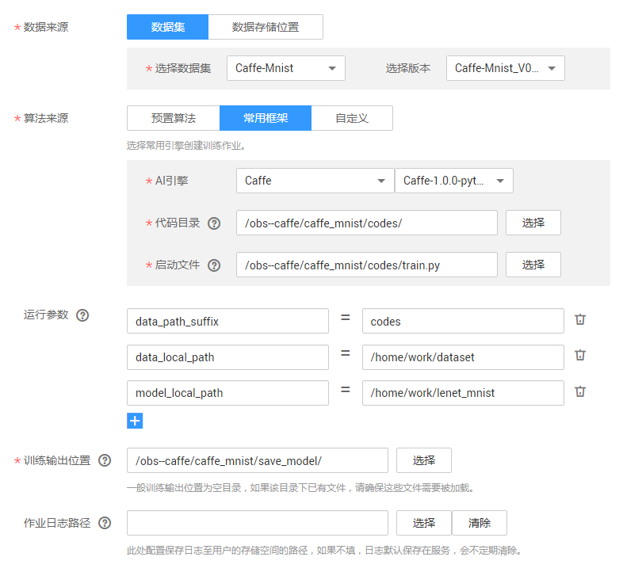

# 使用Caffe实现手写数字图像识别应用

本文介绍在华为云ModelArts平台如何使用Caffe实现MNIST数据集的手写数字图像识别应用。本案例参考Caffe官方文档[Training LeNet on MNIST with Caffe](http://caffe.berkeleyvision.org/gathered/examples/mnist.html)。操作的流程分为3部分，分别是：

基本流程包含以下步骤：

1. **准备数据**：数据集格式转换，然后上传至OBS桶中。
2. **编写模型**：编写prototxt文件定义网络结构和配置网络训练时各种参数，然后上传至OBS桶中。
3. **训练模型**：使用ModelArts服务，新建训练作业进行模型训练。

### 1. 准备数据
通过ModelArts市场预置数据集导入所需数据集版本，具体操作如下：

**步骤 1**  &#160; &#160; 登录“[ModelArts](https://console.huaweicloud.com/modelarts/?region=cn-north-1#/manage/dashboard)”管理控制台，在“全局配置”界面添加访问秘钥。请参考下图。

**步骤 2**  &#160; &#160; 返回“ModelArts”管理控制台，单击左侧导航栏的“市场”。 切换到ModelArts市场的“数据集”页面，找到数据集“Caffe-Mnist”。

**步骤 3**  &#160; &#160; 进入到该预置数据集“Caffe-Mnist”的详情页面，执行“导入到我的数据集”操作，页面会自动跳转到“数据管理>数据集”页面进行创建。

**步骤 4**  &#160; &#160; 在“ModelArts”管理控制台的“数据管理>数据集”页面查看直到mnist数据集（Caffe-Mnist）创建完成，数据详细信息完全加载。

**步骤 5**  &#160; &#160; 在数据集目录页面获取创建的mnist数据集的桶信息“caffe-mnist-dataset/caffe-mnist/”。请参考下图。

### 2. 编写模型
接下来，要编写prototxt文件定义网络结构和配置网络训练时各种参数（本案例中已编写好了相应文件），并编写启动训练的python脚本，操作步骤如下：

**步骤 1**  &#160; &#160; 编写定义网络结构的prototxt文件<a href ="https://github.com/BVLC/caffe/blob/master/examples/mnist/lenet_train_test.prototxt">lenet_train_test.prototxt</a>和配置训练时参数的prototxt文件<a href ="https://github.com/BVLC/caffe/blob/master/examples/mnist/lenet_solver.prototxt">lenet_solver.prototxt</a>，官网提供具体文件，但需要对路径相关参数进行修改（本案例已经对prototxt文件修改，并存放在当前目录下“train”文件夹中）。

**步骤 2** &#160; &#160; 将编写好的prototxt文件和python脚本上传到OBS桶中（ModelArts中训练程序的总大小不能超过10M，由于定义网络结构的prototxt文件可能较大，可以放到数据集目录下；本案例将prototxt文件放到代码目录下）。

**步骤 3（可选）**  &#160; &#160; 如果将prototxt文件放到数据集目录下，在“ModelArts”管理控制台的“数据管理>数据集”页面选择数据集，并点击“数据源同步”。

**步骤 4**  &#160; &#160; 利用[OBS Browser](https://obstool-north.obs.myhwclouds.com/browser/hec/win64/OBSBrowser.zip)创建桶，并参考<a href = "https://support.huaweicloud.com/usermanual-dls/dls_01_0040.html">“上传业务数据”</a>章节内容，将启动训练的python脚本和prototxt文件上传到OBS桶中（注意路径中不要出现中文；本案例中已编写好了训练脚本[train.py](codes/train.py)）。

### 3. 训练模型
最后，利用已经上传的数据集和训练程序脚本完成模型训练，操作步骤如下：

**步骤 1**  &#160; &#160; 在“训练作业”界面，单击左上角的“创建”，参考图1填写训练作业参数。 “名称”和“描述”可以随意填写；“数据来源”请选择“数据集”caffe_mnist{或者“数据的存储位置”(本例中为obs--jnn/datasets/caffe_mnist/)}；点击“增加运行参数”按钮，添加程序运行时需要的参数；**AI引擎选用Caffe。**训练作业参数配置可以参考下图。

运行参数说明：

1. train_url（训练输出路径）：模型输出OBS路径；在ModelArts平台中选中“训练输出位置”后，平台会自动添加train_url参数。
2. data_url：数据集OBS路径；在ModelArts平台中选中“数据来源”后，平台会自动添加train_url参数。
3. num_gpus：使用gpu数目；在ModelArts平台中选中“资源池”后，平台会根据资源池中GPU数目，自动添加num_gpus参数。
4. data_path_suffix：代码目录的最后一级目录名称。例如：本案例中代码目录为'/obs-caffe/caffe_mnist/codes'，则data_path_suffix为'codes'。
5. data_local_path：数据集在容器中的保存路径，执行训练前ModelArts平台会将数据集从OBS拷贝到容器中。
6. model_local_path：训练模型在容器中的保存路径。训练过程需要先将模型保存到容器中，在训练结束以后可以调用’mox.file.copy_parallel‘将模型拷贝到OBS中。

**步骤 2**  &#160; &#160;  参数确认无误后，单击“立即创建”，完成训练作业创建。训练作业完成后，即完成了模型训练过程。如有问题，可点击作业名称，进入作业详情界面查看训练作业日志信息。

**备注**

​	1. 本案例中通过python脚本调用caffe编译后的二进制文件启动训练作业，caffe编译后的二进制文件路径为“/home/work/caffe/bin/caffe.bin”。

​	2. 在训练脚本和prototxt需要使用绝对路径来指定prototxt文件位置。ModleArts平台会自动将”代码目录“指定文件夹拷贝到容器的“/home/work/user-job-dir/”路径下，例如：本案例中代码目录为”/obs--caffe/caffe_mnist/codes/“，则代码会被拷贝到”/home/work/user-job-dir/codes“目录下。

