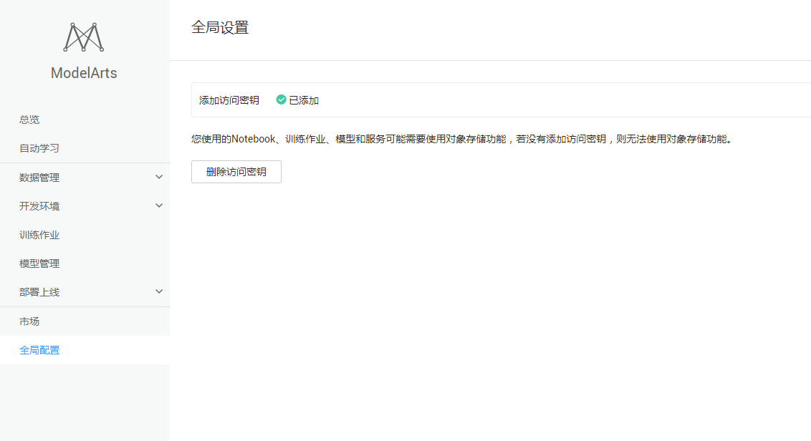
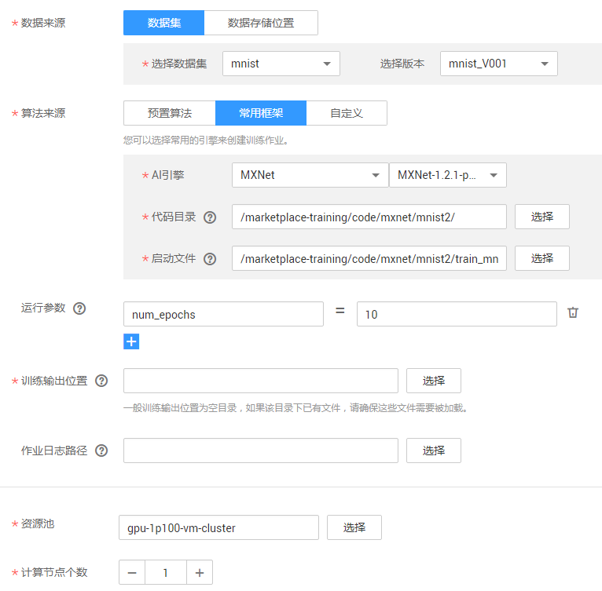
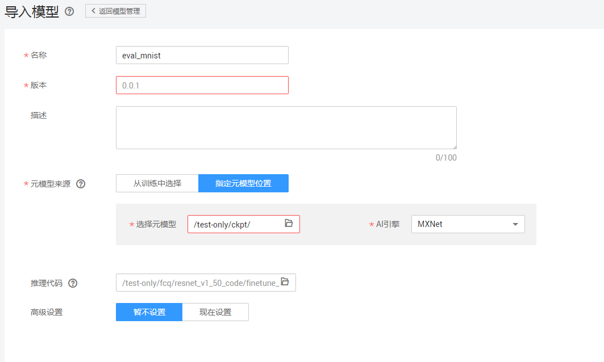
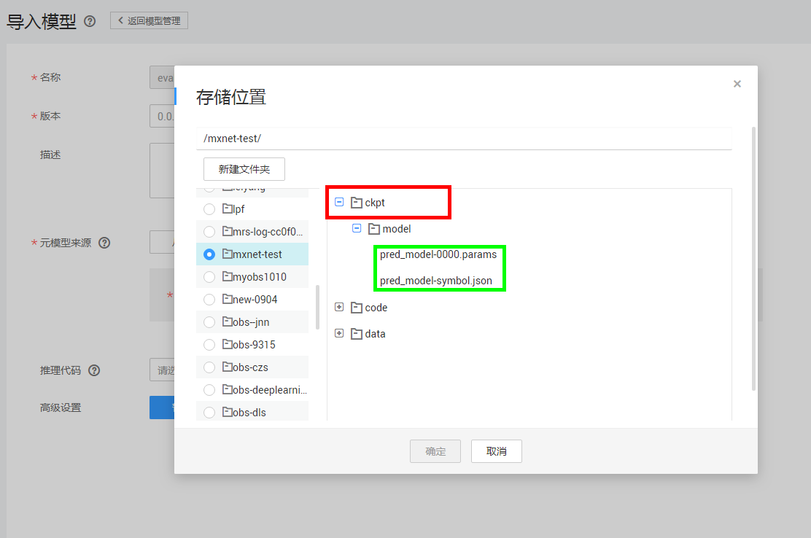
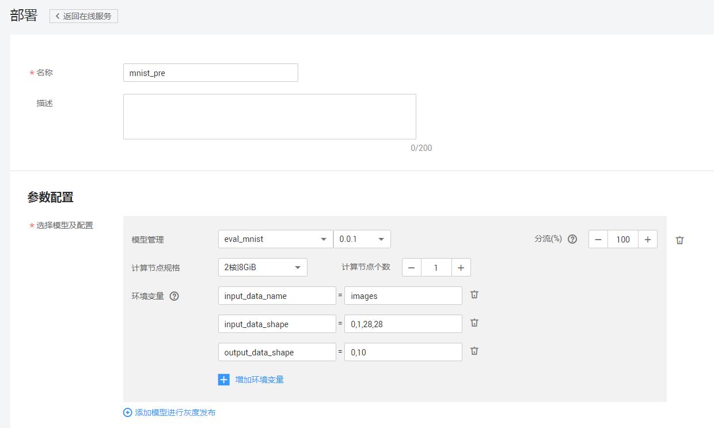
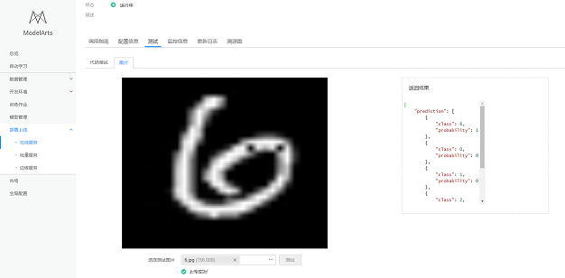

# 使用MXNet实现手写数字图像识别应用

本文介绍在华为云ModelArts平台如何使用MXNet实现MNIST数据集的手写数字图像识别应用。操作的流程分为4部分，分别是：

基本流程包含以下步骤：

1. **准备数据**：下载数据集，解压后上传至OBS桶中。
2. **训练模型**：使用MXNet原生接口编写模型训练脚本，新建训练作业进行模型训练。
3. **部署模型**：得到训练好的模型文件后，新建预测作业将模型部署为在线预测服务。
4. **发起预测请求**：下载并导入客户端工程，发起预测请求获取预测结果。

### 1. 准备数据
通过ModelArts市场预置数据集创建自动学习所需数据集版本，具体操作如下：

**步骤 1**  &#160; &#160; 登录“[ModelArts](https://console.huaweicloud.com/modelarts/?region=cn-north-1#/manage/dashboard)”管理控制台，在“全局配置”界面添加访问秘钥。如图:

**步骤 2**  &#160; &#160; 返回“ModelArts”管理控制台，单击左侧导航栏的“市场”。 切换到ModelArts市场的“数据集”页面，找到数据集“Mnist-Data-Set”。

**步骤 3**  &#160; &#160; 进入到该预置数据集“Mnist-Data-Set”的详情页面，执行“导入到我的数据集”操作，页面会自动跳转到“数据管理>数据集”页面进行创建。

**步骤 4**  &#160; &#160; 在“ModelArts”管理控制台的“数据管理>数据集”页面查看直到mnist数据集（Mnist-Data-Set）创建完成，数据详细信息完全加载。

**步骤 5**  &#160; &#160; 在数据集目录页面获取创建的mnist数据集的桶信息mnist-data-set-73625398-909b-469c-895a-17fc5acc7575/mnist/。请参考下图。

训练需要的数据集(**注意是没有.gz的后缀的文件**)：

- t10k-images-idx3-ubyte：验证集，共包含10000个样本。
- t10k-labels-idx1-ubyte：验证集标签，共包含10000个样本的类别标签。
- train-images-idx3-ubyte：训练集，共包含60000个样本。
- train-labels-idx1-ubyte：训练集标签，共包含60000个样本的类别标签。

### 2. 训练模型
接下来，要编写模型训练脚本代码（本案例中已编写好了训练脚本），并完成模型训练，操作步骤如下：

**步骤 1**  &#160; &#160; 复制由MXNet原生接口编写的模型训练脚本文件<a href ="codes/train_mnist.py">train\_mnist.py</a>，（在github界面右上角点击raw）并将其粘贴到本地的train_mnist.py脚本中，或登录github进行下载。

**步骤 2** &#160; &#160; 参考<a href = "https://support.huaweicloud.com/usermanual-dls/dls_01_0040.html">“上传业务数据”</a>章节内容，将脚本文件上传至华为云OBS桶 （s3://你的桶名/你的文件名/,注意路径中不要出现中文）。

**步骤 3**  &#160; &#160; 在“训练作业”界面，单击左上角的“创建”，参考图1填写训练作业参数。 “名称”和“描述”可以随意填写；“数据来源”请选择“数据集”Mnist-Data-Set{或者“数据的存储位置”(本例中为mnist-data-set-73625398-909b-469c-895a-17fc5acc7575/mnist)}；**AI引擎选用mxnet。**

图2 训练作业参数配置

可选运行参数说明：

1. num_epochs：训练需要迭代的次数，默认10；
2. batch_size：训练的每一步包含的样本数量大小， 默认128；
3. kv_store：使用单计算节点时，kv_store设置为‘local’或‘device’；如果计算节点个数大于1，kv_store需要设置为‘dist_sync’或‘dist_sync_device’，默认‘device’；
4. num_classes：类别数量，默认10；
5. lr：学习率，默认0.05；
6. disp_batches：每隔多少步输出一次，默认20；
7. num_gpus：gpu数量；
8. export_model：是否导出可供预测服务的模型参数，默认为1，表示输出；
9. train_url（训练输出路径）：模型输出路径，可在运行参数添加train_url或训练输出位置二选一添加；
10. data_url：数据集路径；
11. 计算节点规格前者为cpu，后者1*P100为GPU，训练作业推荐使用后者GPU；
12. 计算节点个数，2个及以上为分布式训练，需要更改对应的运行参数kv_store，1则为单机模式不用更改参数kv_store；

**步骤 5**  &#160; &#160;  参数确认无误后，单击“立即创建”，完成训练作业创建。训练作业完成后，即完成了模型训练过程。如有问题，可点击作业名称，进入作业详情界面查看训练作业日志信息。

### 3. 部署模型

模型训练完成后，可以创建预测作业，将模型部署为在线预测服务，操作步骤如下：

**步骤 1**  &#160; &#160; 在“模型管理”界面，单击左上角的“导入”，参考图2填写参数。

图2 导入模型参数配置

其中元模型的路径需要设置为.params和.json文件所在文件夹的上一层文件夹，比如图3红框的路径：/test-only/ckpt/为之前训练作业的输出路径。

图3 元模型指定路径

推理代码参考<a href ="codes/dls_classification_service.py">dls\_classification\_service.py</a> ，名称可随意填写。将推理代码上传到obs，并将其文件路径设置到模型参数配置中的“推理代码”输入框。

**步骤 2**  &#160; &#160; 参数确认无误后，单击“立即创建”，完成模型创建。

当模型状态为“正常”时，表示创建成功。单击部署-在线服务，创建预测服务，参考图4填写参数。

图4 部署在线服务参数配置

参数说明：

1. input_data_name：输入数据的名字；
2. input_data_shape：输入数据需要的形状；
3. output_data_shape：模型输出数据的形状，这里’0,10‘表示输出的类别在0到10之间；

### 4. 发起预测请求
完成模型部署后，在部署上线-在线服务界面可以看到已上线的预测服务名称，点击进入可以进行在线预测，如图5。

图5 在线服务测试

如果想使用自己的手写图片，可以参照[make_your_mnist.py](mnist_pic/make_your_mnist.py)，只需修改图片数据的路径即可，**其中原图需要使用黑底白字**。

输出结果解释：'class'就是类的名称，比如这里我们第一项class为6，就是数字6这一类。类后的参数为概率，即预测为6的可能性为100%，别的数字都为0。

