# 使用MoXing实现冰山图像分类应用

本文介绍如何在华为云ModelArts平台上使用MoXing实现Kaggle竞赛中的冰山图像分类任务。实验所使用的图像为雷达图像，需要参赛者利用算法识别出图像中是冰山（iceberg）还是船（ship）。操作的流程分为4部分，分别是：

1.	**准备数据**：在ModelArts市场预置数据集中找到本实验对应的数据集，编写代码将数据集格式转换成TFRecord。
3.	**训练模型**：使用MoXing API编写用实现冰山图像分类的网络模型，新建训练作业进行模型训练。
4.	**预测结果**：再次新建训练作业，对test数据集进行预测，并将结果保存到csv文件。
5.	**查看结果**：查看csv文件中的预测结果。
### 1. 准备数据
在ModelArts市场预置数据集中找到本实验对应的数据集，然后通过华为云ModelArts在线IDE将数据集格式转换成TFRecord格式，操作步骤如下：

**步骤 1**  &#160; &#160; 登录<a href="https://console.huaweicloud.com/modelarts/?agencyId=8273bfe4984c4510ab374530dfdeee8e&region=cn-north-1&locale=zh-cn#/manage/dashboard">"ModelArts"</a>，管理控制台，单击左侧导航栏的"市场"。

**步骤 2**  &#160; &#160; 切换到ModelArts市场的“数据集”页面，找到冰山图像分类对应的预置数据集“Iceberg-Data-Set”。如图1

图1 预置数据集Iceberg-Data-Set

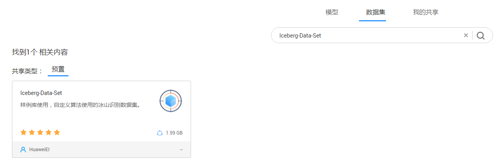

**步骤 3**  &#160; &#160; 进入到该预置数据集Iceberg-Data-Set的详情页面（如图2），执行“导入到我的数据集”，页面会自动跳转到“数据管理>数据集”页面进行创建。

如图2 数据详情页面

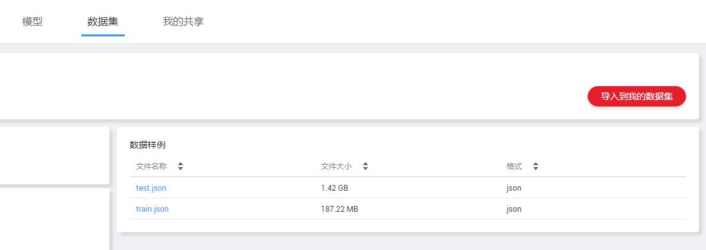

**步骤 4**  &#160; &#160; 在“数据管理>数据集”页面查看直到数据集（Iceberg-Data-Set）创建完成，数据详细信息完全加载。

**步骤 5**  &#160; &#160;  在数据集目录页面获取创建的冰山图像分类数据集的桶信息iceberg-data-set-d91cb8a8-5d46-4101-94d7-3f99391d6fb7/iceberg。请参考图3。

图3 数据集桶信息

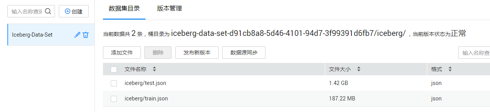

其中，训练集train.json包含4类数据：band\_1、band\_2、inc\_angle和is_iceberg（测试集），分别是：

- band\_1、band\_2：雷达图像的2个通道，分别是75x75的矩阵。
- inc_angle：雷达图拍摄角度，单位是角度。
- is_iceberg： 标注，冰山为1，船为0。

**步骤 6**  &#160; &#160; 登录[“ModelArts”](https://console.huaweicloud.com/modelarts/?region=cn-north-1#/manage/dashboard)管理控制台，在“全局配置”界面添加访问秘钥。

图4 添加访问秘钥

**步骤 7**  &#160; &#160; 在“开发环境”界面，点击“Notebook”，单击“创建”，在弹出框中填写对应参数，镜像类型请选择TF-1.8.0-python27。单击“确定”，完成创建操作。

图5 创建Notebook

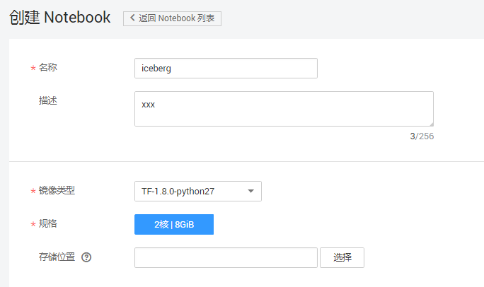

**步骤 8**  &#160; &#160; 在开发环境列表中，单击所创建开发环境右侧的“打开”，进入Jupyter Notebook文件目录界面。单击右上角的“New”，选择“Python 2” ，进入代码开发界面。

图6 创建Notebook开发界面

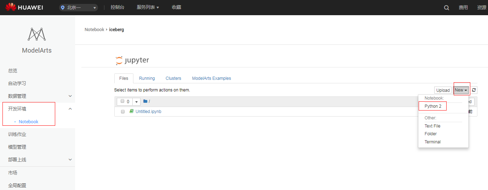

**步骤 9**  &#160; &#160; 在Cell中填写数据转换代码，完整代码请参见<a href ="codes/data_format_conversion.py">data\_format\_conversion.py</a>，请根据数据集实际存储位置，修改脚本代码中的BASE_PATH 参数(本例中为“s3://iceberg-data-set-d91cb8a8-5d46-4101-94d7-3f99391d6fb7/iceberg/”, 即train.json和test.json的OBS父目录。

**步骤 10**  &#160; &#160; 单击Cell上方的 ，运行代码（可能需要较长时间，若长时间没有执行结果，请尝试分段执行代码，将脚本分成多段放在不同的cell中执行，参见图7）。代码运行成功后，将在“s3://iceberg-data-set-d91cb8a8-5d46-4101-94d7-3f99391d6fb7/iceberg/”目录下生成如下三个文件：

- iceberg-train-1176.tfrecord：训练数据集
- iceberg-eval-295.tfrecord：验证数据集
- iceberg-test-8424.tfrecord：预测数据集

图7 脚本分段执行

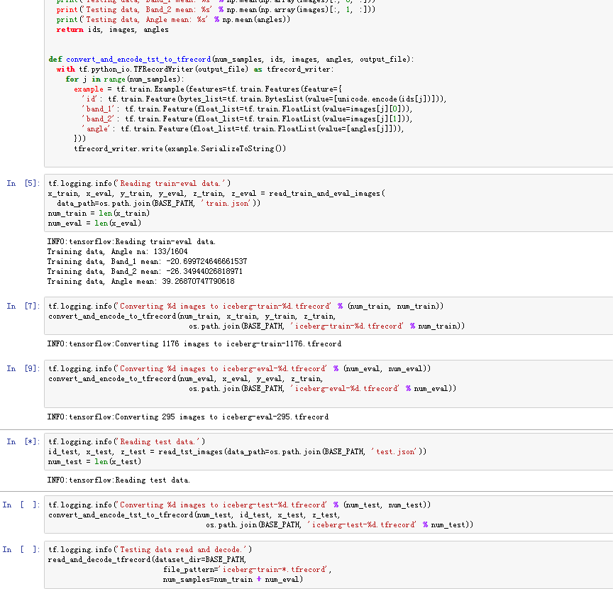

**注意**
**做完后，删除该开发环境。**

### 2. 训练模型

将模型训练脚本上传至OBS桶中（您也可以在ModelArts的开发环境中编写模型训练脚本，并转成py文件），然后创建训练作业进行模型训练，操作步骤如下：

**步骤 1**  &#160; &#160; 参考<a href="https://support.huaweicloud.com/usermanual-dls/dls_01_0040.html">“上传业务数据”</a>章节内容，将模型训练脚本文件<a href ="codes/train_iceberg.py">train\_iceberg.py</a>上传至华为云OBS桶 （假设OBS桶路径为：“s3://modelarts-obs/iceberg/iceberg_code/”）。

**步骤 2**  &#160; &#160; 返回<a href="https://console.huaweicloud.com/modelarts/?agencyId=8273bfe4984c4510ab374530dfdeee8e&region=cn-north-1&locale=zh-cn#/manage/dashboard">"ModelArts"</a>控制台，在“训练作业”界面。 单击左上角的“创建”。

图8 训练作业界面

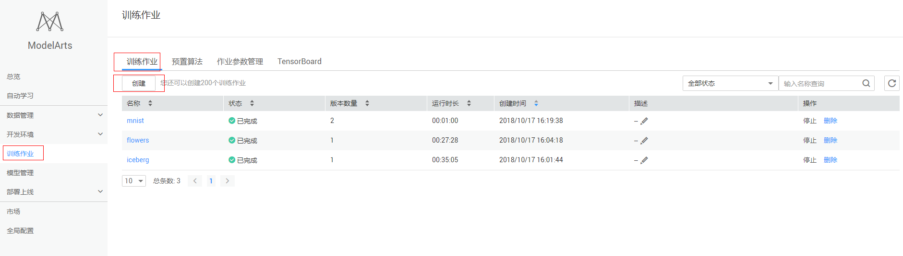

**步骤 3**  &#160; &#160; 填写参数。“名称”和“描述”可以随意填写，“数据来源”请选择“数据的存储位置”(本例中为s3://iceberg-data-set-d91cb8a8-5d46-4101-94d7-3f99391d6fb7/iceberg/)，“算法来源”请选择“常用框架”，“AI引擎”选择“TensorFlow"，“代码目录”请选择型训练脚本文件train\_iceberg.py所在的OBS父目录（“s3://modelarts-obs/iceberg/iceberg_code/”），“启动文件”请选择“train\_iceberg.py”，“训练输出位置”请选择一个路径（例如“s3://modelarts-obs/iceberg/iceberg_log/”）用于保存输出模型和预测文件，参数确认无误后，单击“立即创建”，完成训练作业创建。

图9 训练作业参数配置

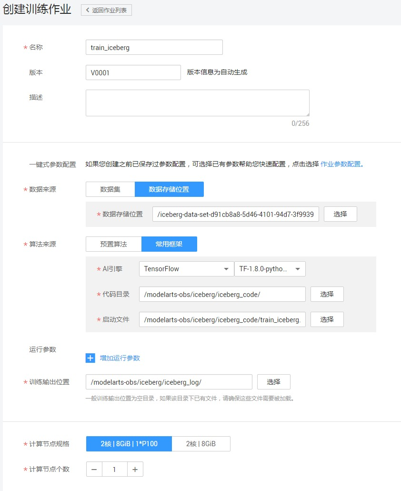

**步骤 4**  &#160; &#160; 在模型训练的过程中或者完成后，可以通过创建TensorBoard作业查看一些参数的统计信息，如loss，accuracy等。在“训练作业”界面，点击TensorBoard，再点击“创建”按钮，参数“名称”可随意填写，“日志路径”请选择步骤3中“训练输出位置”参数中的路径（“s3://modelarts-obs/iceberg/iceberg_log/”），参见图10、11。

图10 创建tensorboard

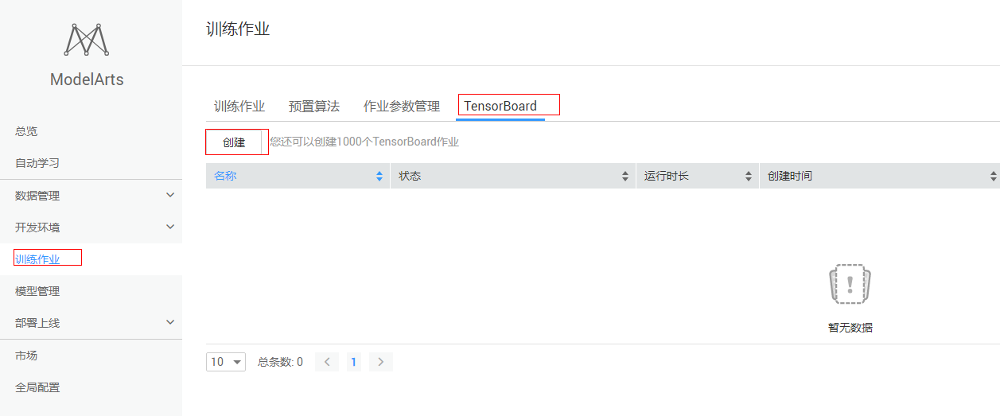

图11 创建tensorboard参数配置

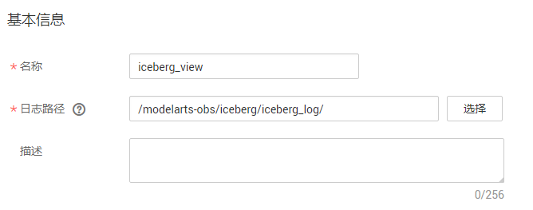

**步骤 5** 训练作业完成后，即完成了模型训练过程。如有问题，可点击作业名称，进入作业详情界面查看训练作业日志信息。训练作业完成详情参见图12.

图12 训练作业完成

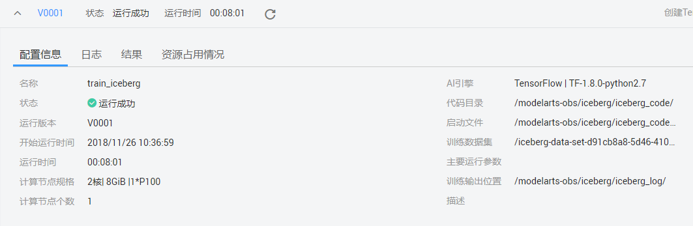
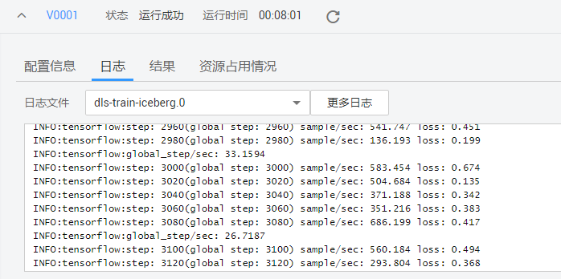

**注意：**

**训练时间超过一定时间，请及时手动停止，释放资源。否则会导致欠费，尤其对于使用GPU训练的模型项目。**

### 3. 预测结果
待训练作业运行完成后，在“训练输出位置”目录下生成模型文件。由于我们只需要进行一次预测，因此不需要部署在线预测服务。相关的预测操作已经在“train_iceberg.py”文件写好，预测结果将输出到“submission.csv”文件。我们使用训练作业进行预测，操作步骤如下：

**步骤 1**  &#160; &#160; 参考“**2.训练模型**”在“训练作业”界面，单击左上角的“创建”。

**步骤 2**  &#160; &#160; 填写参数，“训练输出位置”请保持一致(“s3://modelarts-obs/iceberg/iceberg_log/”)，预测时‘计算节点个数’只能选择1个节点，务必添加参数“is_training=False”，单击“立即创建”，完成训练作业创建。

图13 训练作业-预测

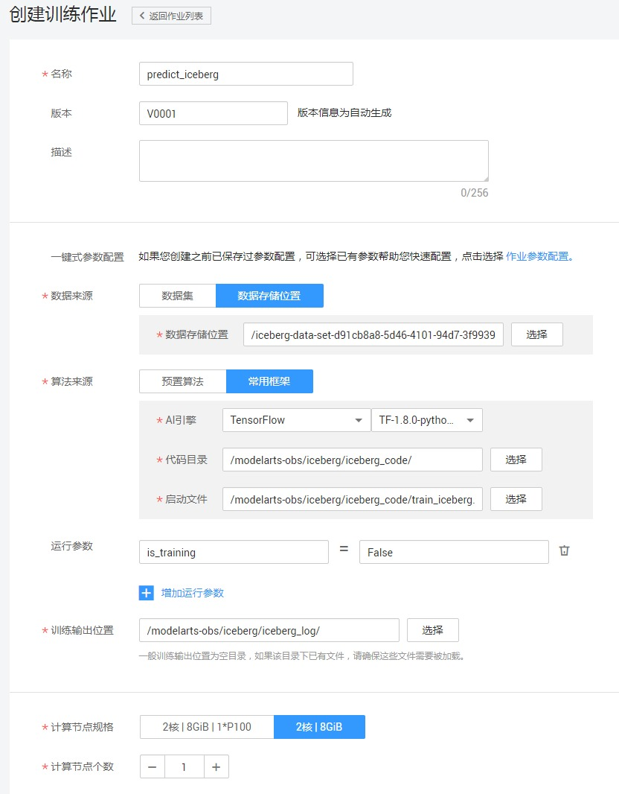

**步骤 3**  &#160; &#160; 训练作业执行完成后，在“训练作业”界面，单击iceberg_predict作业名称，进入作业的详情界面。在“训练日志”中，可以查看到在eval数据集上的loss值。

图14 预测结果详情

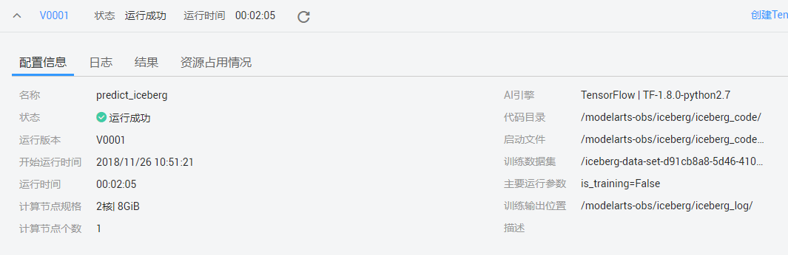
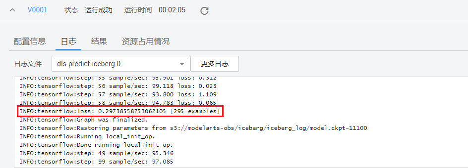

**注意：**

**训练时间超过一定时间，请及时手动停止，释放资源。否则会导致欠费，尤其对于使用GPU训练的模型项目。**

### 4. 查看结果
在“训练输出位置”目录下（“s3://modelarts-obs/iceberg/iceberg_log/”），能看到用于保存预测结果的“submission.csv”文件。

图15 结果

