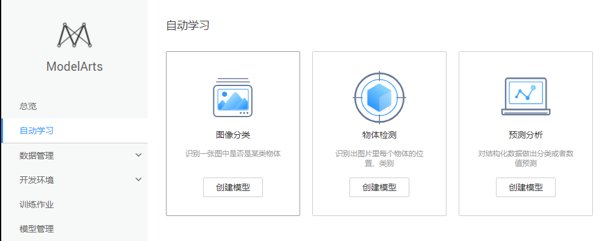
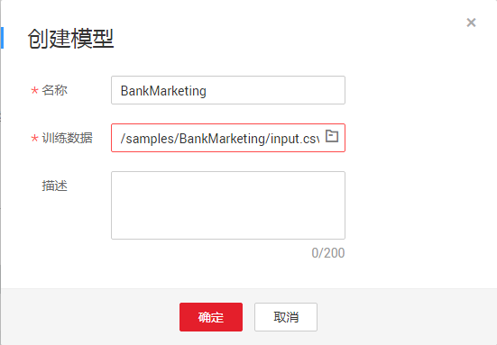
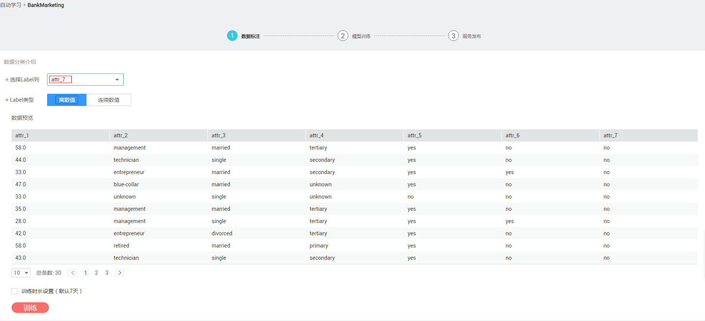
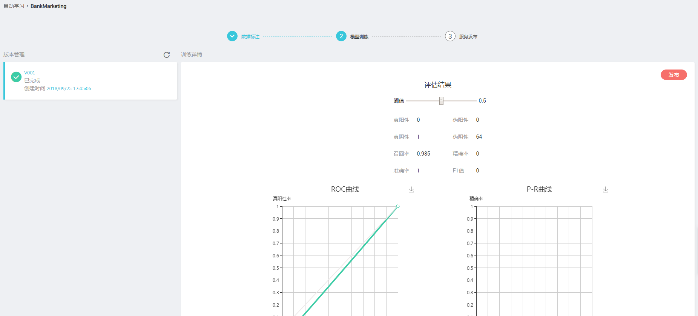

# 使用ModelArts实现银行存款预测应用

银行中常见一种业务：根据客户特征（年龄、工作类型、婚姻状况、文化程度、是否有房贷和是否有个人贷款），预测客户是否愿意办理定期存款业务。

现在您可以借助华为云ModelArts服务平台上的自动学习场景，省时省力预测某个客户是否会办理存款业务。使用流程分为4部分，分别是：

1.	**准备数据**：下载数据集并上传至华为云OBS桶中。
2.	**训练模型**：使用ModelArts服务，新建训练作业进行模型训练。
3.	**发布预测**：将训练好的模型发布，并测试预测结果。

### 1. 准备数据
该数据整理来自UCI的Machine Learning Repository，参考<a href="https://archive.ics.uci.edu/ml/datasets/Bank+Marketing">数据介绍</a>。
您可以直接使用data目录的训练数据集，并上传至华为云OBS桶中。操作步骤如下：

**步骤 1**  &#160; &#160; 从data目录下载输入数据<a href ="data/train.csv">train.csv</a>。

**步骤 2**  &#160; &#160; 浏览并理解训练数据。

数据源的具体字段如下：

表1 数据源的具体字段及意义

| 字段名 | 含义 | 类型 | 描述 |
| :------: | :------: | :------: | :------: |
| attr_1 | 年龄 | Int | 表征客户的年龄 |
| attr_2 | 职业 | String | 表征客户所从事的职业 |
| attr_3 | 婚姻情况 | String | 表征客户是否结婚或已离异 |
| attr_4 | 教育情况 | String | 表征客户受教育的程度 |
| attr_5 | 房产情况 | String | 表征客户名下是否有房产 |
| attr_6 | 贷款情况 | String | 表征客户名下是否有贷款 |
| attr_7 | 存款情况 | String | 表征客户名下是否有存款 |

数据集部分样本数据如下：

表2 数据集样本数据

| attr_1 | attr_2 | attr_3 | attr_4 | attr_5 | attr_6 | attr_7 |
| :------: | :------: | :------: | :------: | :------: | :------: | :------: |
| 58 | management | married | tertiary | yes | no | no |
| 44 | technician | single | secondary | yes | no | no |
| 33 | entrepreneur | married | secondary | yes | yes | no |
| 47 | blue-collar | married | unknown | yes | no | no |
| 33 | unknown | single | unknown | no | no | no |
| 35 | management | married | tertiary | yes | no | no |

**步骤 3**  &#160; &#160; 下载训练数据集文件后，将数据集从本地上传到OBS桶中。

### 2. 训练模型
使用ModelArts服务，新建训练作业进行模型训练，操作步骤如下：

**步骤 1**  &#160; &#160; 打开ModelArts界面，选定“自动学习”场景，并创建预测分析模型。创建模型时，选定上一步上传到OBS的训练数据。

图1 创建预测模型

图2 选定数据地址

**步骤 2**  &#160; &#160; 进入已创建好的模型，预览数据并选择训练目标。此处我们的训练目标是客户是否会办理贷款(即attr_7)，该列目标结果是离散值。
查看完成后，单击“训练”，启动训练作业。

图3 训练作业参数

**步骤 3**  &#160; &#160; 等待训练完成，并查看模型训练结果。通过评估结果查看模型的训练效果

图4 模型训练管理界面

**步骤 4**  &#160; &#160; 点击“发布”，

### 3. 发布预测
待训练作业运行完成后，即可发布模型成预测服务。操作步骤如下：

**步骤 1**  &#160; &#160; 在“模型训练管理”界面，单击左上角的“发布”。

**步骤 2**  &#160; &#160; 在“服务发布管理”界面，测试预测服务。
