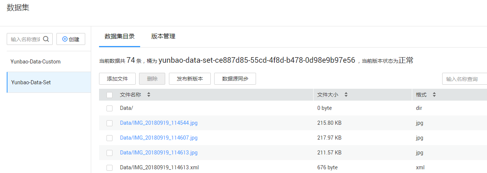
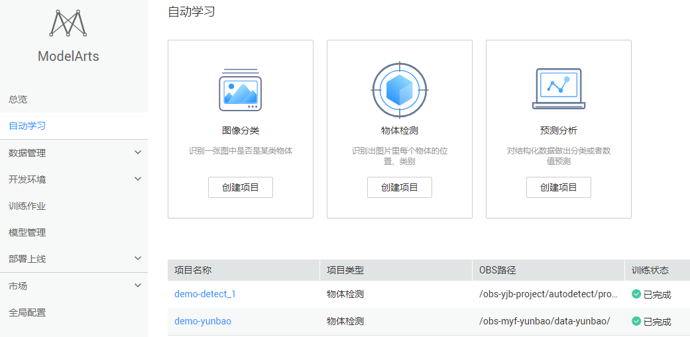
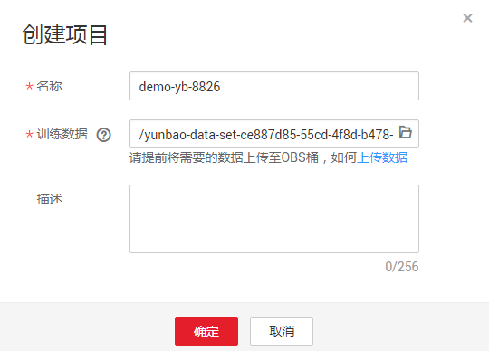
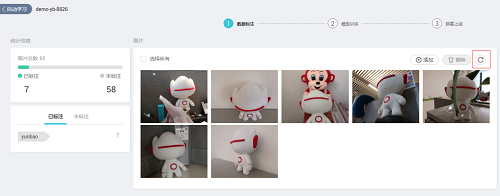
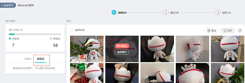
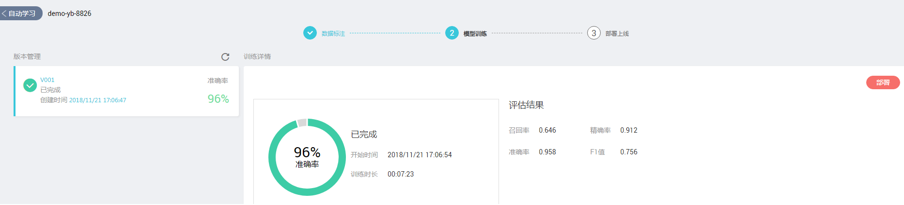
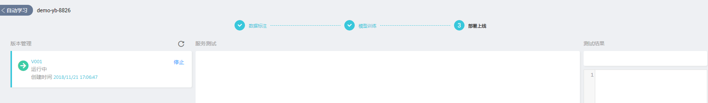
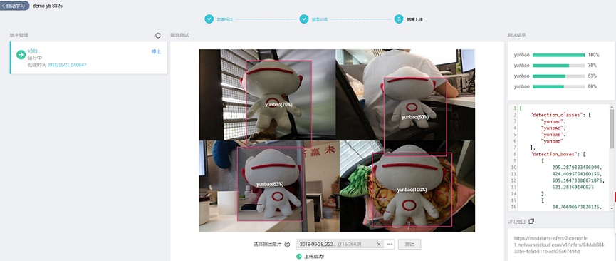
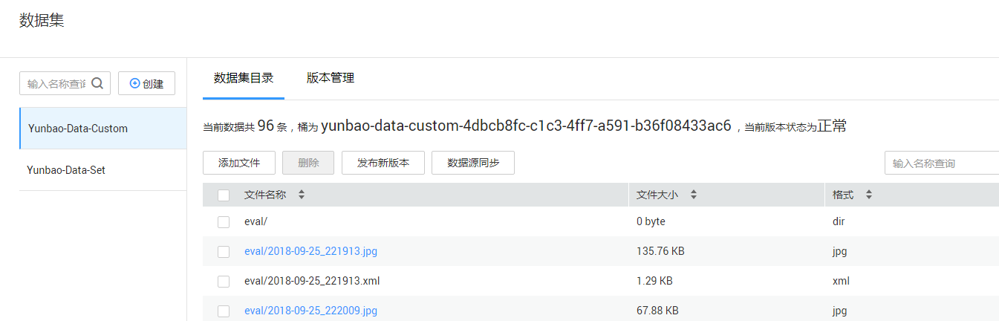

# 使用自动学习方法和预置算法快速生成云宝检测模型
聪明可爱的“云宝”是华为云的吉祥物。本样例将详细介绍怎样用自动学习方法和预置算法快速生成云宝检测模型。

## 服务配置

如果是第一次使用ModelArts服务，在使用之前需要给服务添加访问密钥，授权作业能够访问华为云存储OBS，若没有添加访问秘钥，则无法创建作业。具体操作步骤如下：

1.	**生成访问秘钥**：在用户基本信息>管理我的凭证页面新增访问秘钥，创建后秘钥会下载到本地。
2.	**设置ModelArts全局配置**：在ModelArts服务页面，添加访问秘钥，以授权访问OBS，使用ModelArts各项功能。

### 1. 生成访问秘钥

登陆华为云控制台访问账号中心，用户新增访问秘钥并下载到本地保存，操作步骤如下：

**步骤 1** &#160; &#160;   通过华为云账号访问华为云控制台，点击控制台右上角用户账号信息，跳转到“用户中心”。请参考图1。

图1 “用户中心”页面

**步骤 2** &#160; &#160; 在“用户中心>基本信息”页面点击“管理我的凭证”，跳转到“我的凭证”页面。请参考图2。

图2 “我的凭证”页面

**步骤 3** &#160; &#160; 在“我的凭证”页面切换到“管理访问秘钥”页签，执行“新建访问密钥”操作，输入登陆密码和短信验证码后，密钥会自动生成并下载到本地，文件名为“credentials.csv”。请参考图3。

图3 新增访问秘钥

### 2. 设置ModelArts全局配置

登陆ModelArts服务控制台，在“全局配置”中设置全局访问秘钥，具体操作步骤如下：

**步骤 1** &#160; &#160; 登陆ModelArts服务页面，通过左侧导航栏进入到“全局配置”页面。请参考图4。

图4 全局配置界面

**步骤 2** &#160; &#160; 执行“添加访问秘钥”操作，输入“credentials.csv”文件中的“Access Key”和“Secret Access Key”信息，执行确定操作，完成全局秘钥的设置。请参考图5。

图5 添加访问秘钥

## 使用自动学习实现云宝检测模型

本章节介绍在华为云ModelArts平台如何使用自动学习物体检测对预置的云宝数据集进行训练，快速构建云宝图像识别应用。操作步骤分为2部分，分别是：

1.	**准备数据**：在ModelArts市场预置数据集中找到自动学习对应的云宝数据集，并根据该原始数据集生成自动学习可处理的数据集。
2.	**自动学习模型训练发布**：使用自动学习物体检测模型对创建的云宝数据集进行训练并发布服务。

### 1. 准备数据

通过ModelArts市场预置数据集创建自动学习所需数据集版本，操作步骤如下：

**步骤 1** &#160; &#160; 登录“ModelArts”管理控制台，单击左侧导航栏的“市场”。

**步骤 2** &#160; &#160; 切换到ModelArts市场的“数据集”页面，找到自动学习对应的云宝预置数据集“Yunbao-Data-Set”。

**步骤 3** &#160; &#160; 进入到该预置数据集Yunbao-Data-Set的详情页面，执行“导入我的数据集操作”，输入自定义的数据集名称与桶名后（本例输入数据集名称为Yunbao-Data-Set，桶名为yunbao-data-set-ce887d85-55cd-4f8d-b478-0d98e9b97e56），点击前往数据集，页面会自动跳转到“数据管理>数据集”页面进行创建。

**步骤 4** &#160; &#160; 在“数据管理>数据集”页面查看直到云宝数据集（Yunbao-Data-Set）创建完成，数据详细信息完全加载。

**步骤 5** &#160; &#160; 在数据集目录页面获取创建的云宝数据集的桶信息yunbao-data-set-ce887d85-55cd-4f8d-b478-0d98e9b97e56。请参考图6。

图6 数据集

### 2. 自动学习模型训练发布

接下来将使用自动学习>物体检测模型对云宝数据集进行训练并发布模型，操作步骤如下：

**步骤 1** &#160; &#160; 返回“ModelArts”管理控制台界面。单击左侧导航栏的“自动学习”，进入“自动学习”界面。请参考图7。

图7 自动学习界面

**步骤 2** &#160; &#160; 点击“物体检测”创建项目按钮，创建自动学习>物体检测工程，自定义工程名称（本例输入demo-yb-8826），训练数据选择云宝数据集的OBS路径/yunbao-data-set-c79800ac-abb5-40f4-8398-60e50f503649/Data/（确保目录结构正确，只选择到Data层），执行“确定”操作完成物体检测工程创建。请参考图8。

图8 创建项目

**步骤 3** &#160; &#160; 在自动学习页面，点击工程名称demo-yb-8826进入到自动学习详情页面，点击刷新按钮，执行“数据源同步”操作。最终显示“数据源同步完成”说明数据同步成功。请参考图9。

图9 数据源同步

**步骤 4** &#160; &#160; 本次提供的数据集部分数据已经标注，用户可直接使用已经标注的部分进行训练，但如果对模型精度有更高要求，可在“未标注”页签点击图片上的“图片标注”按钮进入到数据标注页面对未标注部分图片进行标注。图片标注完成后，可直接执行“开始训练”操作，启动模型训练。请参考图10。

图10 图片标注

**步骤 5** &#160; &#160; 在“模型训练”页签刷新训练状态，当状态为“已完成”时可执行“部署上线”操作，完成物体检测模型部署。请参考图11，图12。

图11 模型训练完成

图12 模型部署

**步骤 6** &#160; &#160; 在“部署上线”页签可上传云宝图片进行模型测试（由于发布期间使用人数很多，服务在“运行中”状态后，可能还需要1分钟的资源预处理时间，请耐心等待，1分钟后再进行测试），测试结果可在页面上进行显示，如果觉得模型准确率不满足预期，可在“数据标注”页签中添加图片并进行标注，再次进行模型训练及发布。请参考图13。

图13 部署上线

## 使用预置模型实现云宝检测模型

本章节介绍在华为云ModelArts平台如何使用预置算法Faster_RCNN_ResNet_v1_50对预置的云宝数据集进行训练，快速构建云宝图像识别应用。操作步骤分为3部分，分别是：

**1.	准备数据**：在ModelArts市场预置数据集中找到预置算法对应的云宝数据，并根据该原始数据集生成自动学习可处理的数据集。

**2.	训练模型**：使用创建的云宝数据集，对Faster_RCNN_ResNet_v1_50模型重训练，得到新模型。

**3.	部署模型**：根据训练作业创建模型并进行发布，部署为在线预测服务，并对该模型服务发起预测。

### 1. 准备数据

通过ModelArts市场预置数据集创建预置算法所需数据集版本，操作步骤如下：

**步骤 1** &#160; &#160;  登录“ModelArts”管理控制台，单击左侧导航栏的“市场”。

**步骤 2** &#160; &#160;  切换到ModelArts市场的“数据集”页面，找到预置算法对应的云宝预置数据集“Yunbao-Data-Custom”。

**步骤 3** &#160; &#160;  进入到该预置数据集的详情页面，执行“导入我的数据集操作”，输入自定义的数据集名称与桶名后（本例输入数据集名称为Yunbao-Data-Custom，桶名为yunbao-data-custom-4dbcb8fc-c1c3-4ff7-a591-b36f08433ac6），点击前往数据集，页面会自动跳转到“数据管理>数据集”页面进行创建。

**步骤 4** &#160; &#160;  在数据管理>数据集页面查看到直到云宝数据集创建完成，数据信息详细信息完全加载。

**步骤 5** &#160; &#160;  在数据集目录页面获取创建的云宝数据集Yunbao-Data-Custom的桶信息yunbao-data-custom-c264a6fe-c78b-4a72-ab68-2d6683eb9828。数据集中数据部分进行了标注（20张），如果想要得到更好的训练结果，请执行步骤6-9；如果不需要标注，请直接进行“训练模型”操作。

**步骤 6** &#160; &#160;  通过左侧导航栏切换到“数据管理>数据标注”页面，创建数据标注任务。自定义标注任务名称（这里设置为label_yunbao_8826）；“待标注作业”选择“从OBS选择”，路径为云宝数据集目录/yunbao-data-custom-4dbcb8fc-c1c3-4ff7-a591-b36f08433ac6/Yunbao-Data-Custom/train（确保目录结构正确，只选择到train层）；“人工标注类型”选择“物体检测”，然后执行“创建”操作。

**步骤 7** &#160; &#160; 在数据标注页面点击标注任务名称“label_yunbao_8826”进入到标注详情页面，执行“数据源同步”操作，同步OBS中的数据。

**步骤 8** &#160; &#160; 数据同步完成后可切换到“未标注”页签，其中有40张图片未标注，点击图片上的“图片标注”按钮，进行云宝图像标注。待图片标注足够后执行保存操作完成图片标注。

**步骤 9** &#160; &#160; 切换到“数据管理>数据集”页面，选择数据集Yunbao-Data-Custom，执行数据集的“数据源同步”操作，待数据同步完成后，执行“发布新版本”操作，发布最新的云宝数据集。请参考图15。

图15 数据集（预置模型）

### 2. 训练模型

接下来将使用训练作业中的预置算法Faster_RCNN_ResNet_v1_50对云宝数据集进行训练并发布模型，操作步骤如下：

**步骤 1** &#160; &#160;通过华为云账号进入到OBS控制台，创建桶obs-xxxx-output，并在该桶下创建目录output1，用于存放训练输出模型。请参考图16，图17。

图16 obs界面

图17 创建桶

**步骤 2** &#160; &#160;单击左侧导航栏的“训练作业”，进入“训练作业”列表界面。请参考图18。

图18 训练作业界面

**步骤 3** &#160; &#160;执行“创建”操作跳转到训练创建页面，在创建页面输入名称demo-resnet-yunbao，“数据来源”选择“数据集”Yunbao-Data-Custom，版本选择“Yunbao-Data-Custom_V001（V00X为待训练的数据版本，可根据实际情况进行选择）”；“算法来源”选择“预置算法”Faster_RCNN_ResNet_v1_50，“训练输出位置”选择步骤1中创建的/obs-xxxx-output/output1；计算规格选择“2核|8GB|1*P100”，实例个数为1，执行“立即创建”操作。请参考图19。

图19 创建训练作业

**步骤 4** &#160; &#160;在训练作业列表页面观察demo-resnet-yunbao直到状态变成“已完成”，进入到该训练详情页面，可查看该训练的“结果”，如果结果不满意，可通过添加更多图片重新训练模型。请参考图20。

图20 查看训练结果

### 3. 部署模型

完成训练后，用户可通过训练导入功能创建模型，并且可将模型部署在线服务，并发起预测。操作步骤如下：

**步骤 1** &#160; &#160;在“模型管理”界面，执行“导入”操作，在导入页面输入名称（本例输入demo-yb-8826），版本1.0.0，元模型来源为从训练中选择，选择训练demo-resnet-yunbao，版本为V000X（如果训练多次，可选择一个最满意一个版本），执行“立即创建”。请参考图21。

图21 导入模型

**步骤 2** &#160; &#160;在模型列表页面找到demo-yb-8826，查看状态直到变成“正常”。

图22 模型管理

