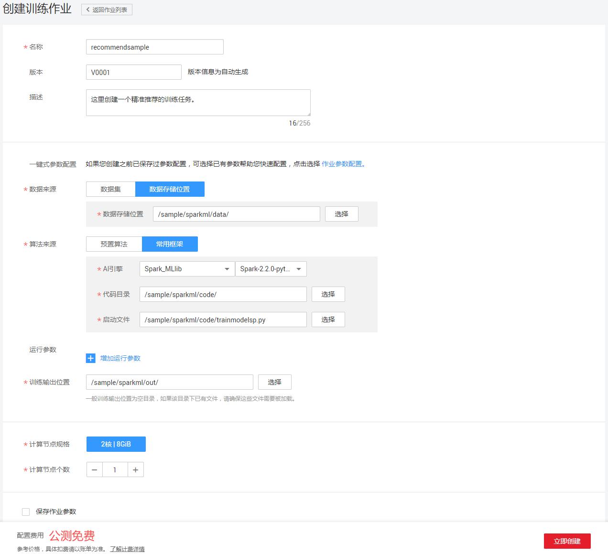
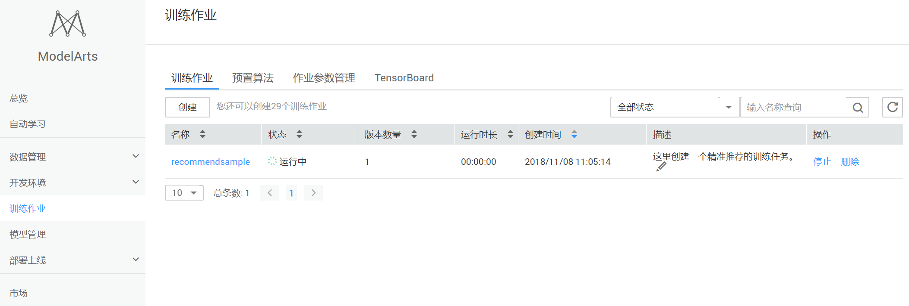
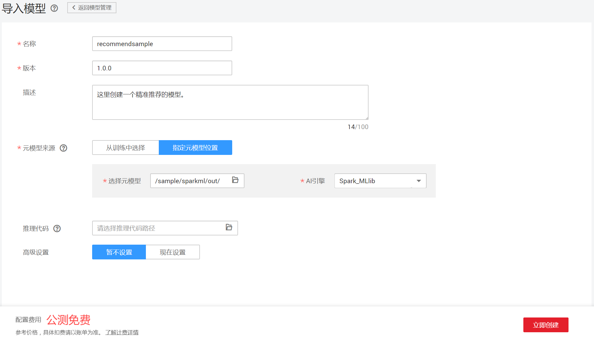
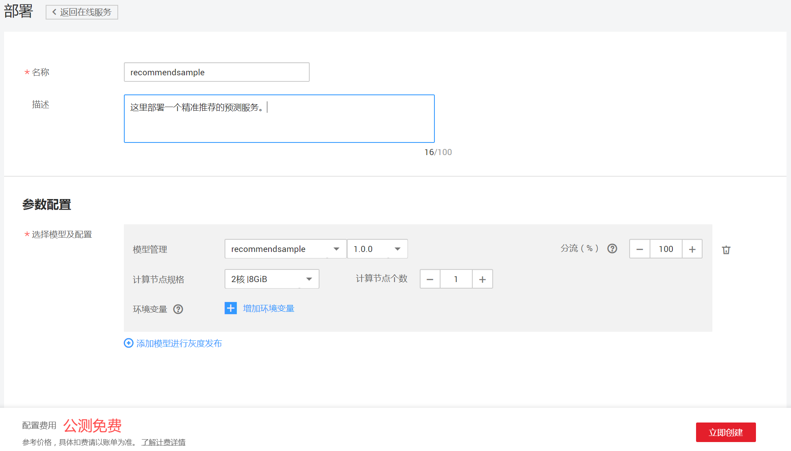
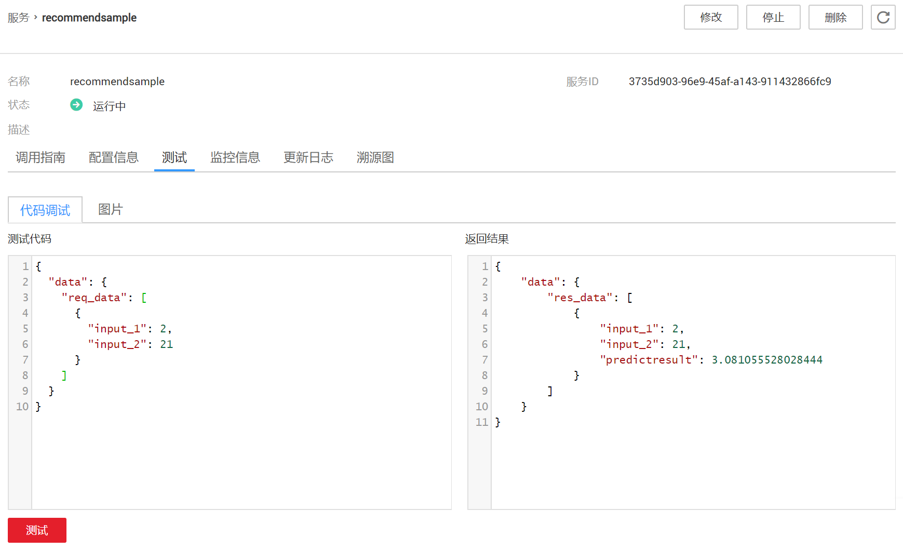
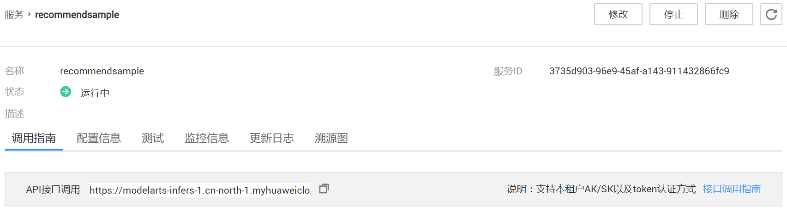

# 使用ModelArts实现精准推荐应用

消费无处不在，但每一次消费行为带给人们的感受却或好或坏。在时间成本高昂的背景下，消费者不希望花太多时间就能找到自己喜欢的事物。而快速、准确的消费品推荐，可显著降低消费者寻找的时间成本，不但提升用户消费感受，也能提高商家的销售量。

现在您可以借助华为云ModelArts服务平台上的自动学习场景，为您提供精准营销的方向和辅助决策，提升消费品转化率和商家利润，改善消费者的消费体验。

使用流程分为4部分，分别是：

1. **准备工作**：下载数据集、实例代码，然后上传至OBS桶中。
2. **训练模型**：编写基于Spark MLlib中ALS算法的模型训练脚本，新建训练作业进行模型训练。
3. **部署模型**：得到训练好的模型文件后，新建预测作业将模型部署为在线预测服务。
4. **验证模型**：下载并导入客户端工程，发起预测请求获取预测结果。

### 1. 准备工作
您可以直接使用data目录的训练数据集，并上传至华为云OBS桶中。操作步骤如下：

**步骤 1**  &#160; &#160; 从data目录下载输入数据<a href ="data/ratings.csv">ratings.csv</a>。

**步骤 2**  &#160; &#160; 浏览并理解训练数据。

数据源的具体字段如下：

表1 数据源的具体字段及意义

| 字段名 | 含义 | 类型 | 描述 |
| :------: | :------: | :------: | :------: |
| attr_1 | 用户id | Int | 消费者标识 |
| attr_2 | 商品id | Int | 消费品标识 |
| attr_3 | 评分 | Real | 消费者对消费品的评分（1-5） |

数据集部分样本数据如下：

表2 数据集样本数据

| attr_1 | attr_2 | attr_3 |
| :------: | :------: | :------: |
| 1 | 146 | 5 |
| 1 | 1198 | 4 |
| 1 | 611 | 4 |
| 2 | 914 | 3 |
| 2 | 146 | 4 |

**步骤 3**  &#160; &#160; 下载训练数据集文件后，将数据集从本地上传到OBS桶的数据目录。示例中训练数据上传到“sample”桶的“/sparkml/data/”目录，实际使用中请填写自己创建的桶名。

**步骤 4**  &#160; &#160; 编写使用ALS算法的python脚本，本上传到OBS桶的代码目录。脚本可以参考<a href ="code/trainmodelsp.py">trainmodelsp.py</a>。示例中脚本上传到“sample”桶的“/sparkml/code”目录。

**步骤 5**  &#160; &#160; 创建OBS桶的模型目录。示例中指定输出模型保存到“sample”桶的“/sparkml/out”目录。

### 2. 训练模型
使用ModelArts服务，新建训练作业进行模型训练，操作步骤如下：

**步骤 1**  &#160; &#160; 打开ModelArts界面，选定“训练作业”场景，选择“训练作业”页签，并点击“创建按钮”。创建模型时，选定“Spark_MLlib”引擎，并选定已上传到OBS的训练数据以及训练代码。详细参数设置参见图1。

图1 创建训练作业参数

**步骤 2**  &#160; &#160; 点击“立即创建”按钮，启动训练作业并等待作业运行完成。
在“训练作业”页签中，可以选中训练任务查看详情，训练作业页签界面参见图2。

图2 训练作业页签界面

### 3. 部署模型
待训练作业运行完成后，可以将训练好的模型发布成预测服务。操作步骤如下：

**步骤 1**  &#160; &#160; 在“模型管理”界面，单击左上角的“导入”按钮，填写模型的信息。填写信息参考图3。

图3 导入模型参数

**步骤 2**  &#160; &#160; 在“部署上线”功能中选中“在线服务”，单击左上角的“部署”按钮，填写在线预测服务的信息。填写信息参考图4。
服务发布需要一定时间，耐心等待即可。

图4 部署在线服务参数

### 4. 验证模型
待部署模型运行完成后，可以验证发布的预测服务是否正常。操作步骤如下：

**步骤 1**  &#160; &#160; 在“在线服务”界面，可以选中刚刚发布的模型，并查看服务的详细信息。

**步骤 2**  &#160; &#160; 在“测试”页签，可以编辑测试的输入数据，并测试预测服务是否正常。

图5 在线服务测试界面

**步骤 3**  &#160; &#160; 在“调用指南”页签，可以获取调用API接口，并使用Postman工具进行进行测试。

图6 在线服务调用指南界面

