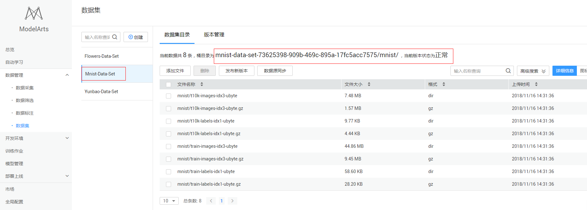
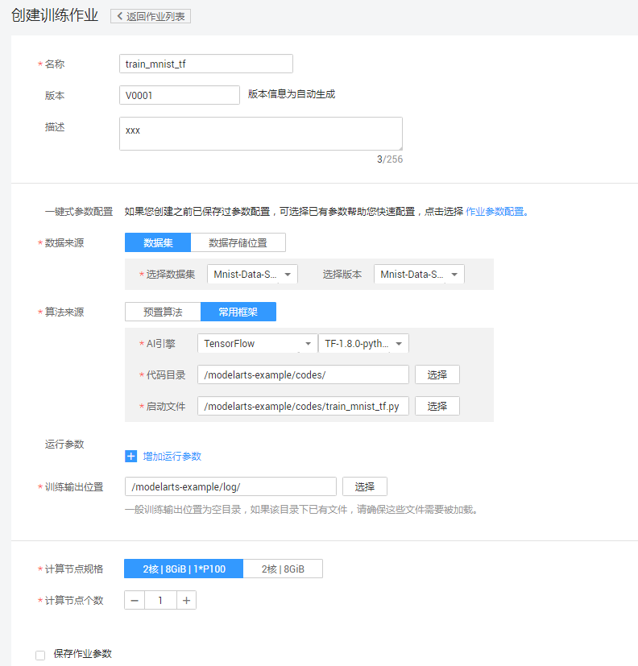
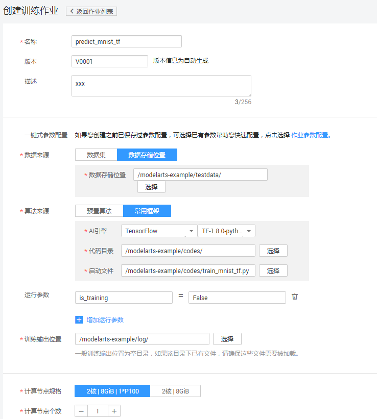

# 使用TensorFlow实现手写数字图像识别应用

本文介绍在华为云ModelArts平台如何使用TensorFlow实现MNIST数据集的手写数字图像识别应用。操作的流程分为4部分，分别是：

基本流程包含以下步骤：

1. **准备数据**：通过ModelArts市场预置数据集创建所需数据集版本。
2. **训练模型**：使用TensorFlow框架编模型训练脚本，新建训练作业进行模型训练。
3. **预测结果**：得到训练好的模型文件后，新建训练作业对test数据集进行预测，并输出预测结果。

### 1. 准备数据
通过ModelArts市场预置数据集创建所需数据集版本，具体操作如下：

**步骤 1**  &#160; &#160; 登录“[ModelArts](https://console.huaweicloud.com/modelarts/?region=cn-north-1#/manage/dashboard)”管理控制台，在“全局配置”界面添加访问秘钥。如图1。

图1 添加访问秘钥

**步骤 2**  &#160; &#160; 返回“ModelArts”管理控制台，单击左侧导航栏的“市场”。 切换到ModelArts市场的“数据集”页面，找到数据集“Mnist-Data-Set”。

**步骤 3**  &#160; &#160; 进入到该预置数据集“Mnist-Data-Set”的详情页面，执行“导入到我的数据集”操作，页面会自动跳转到“数据管理>数据集”页面进行创建。

**步骤 4**  &#160; &#160; 在“ModelArts”管理控制台的“数据管理>数据集”页面查看直到mnist数据集（Mnist-Data-Set）创建完成，数据详细信息完全加载。

**步骤 5**  &#160; &#160; 在数据集目录页面获取创建的mnist数据集的桶信息mnist-data-set-73625398-909b-469c-895a-17fc5acc7575/mnist/。请参考下图。

图2 数据集

### 2. 训练模型
接下来，要编写模型训练脚本代码（本案例中已编写好了训练脚本），并完成模型训练，操作步骤如下：

**步骤 1**  &#160; &#160; 下载模型训练脚本文件[train\_mnist\_tf.py](https://github.com/huawei-clouds/modelarts-example/blob/master/Using%20TensorFlow%20to%20Create%20a%20MNIST%20Dataset%20Recognition%20Application/codes/train_mnist_tf.py)。参考<a href="https://support.huaweicloud.com/usermanual-dls/dls_01_0040.html">“上传业务数据”</a>章节内容，将脚本文件上传至华为云OBS桶 （假设OBS桶路径为：/modelarts-example/codes/）。

**步骤 2**  &#160; &#160; 在“训练作业”界面，单击左上角的“创建”, “名称”和“描述”可以随意填写；“数据来源”请选择“数据集”Mnist-Data-Set{或者数据的存储位置”(本例中为mnist-data-set-73625398-909b-469c-895a-17fc5acc7575/mnist/)}；“算法来源”请选择“常用框架”，“AI引擎”选择“TensorFlow"；“代码目录”请选择型训练脚本文件train\_mnist\_tf.py所在的OBS父目录（/modelarts-example/codes/）；“启动文件”请选择“train\_mnist.py”；“训练输出位置”请选择一个路径（例如/modelarts-example/log/）用于保存输出模型和预测文件，参考下图填写训练作业参数.

图3 训练作业参数配置（训练）

**步骤 3**  &#160; &#160;  参数确认无误后，单击“立即创建”，完成训练作业创建。

**步骤 4**  &#160; &#160; 在模型训练的过程中或者完成后，通过创建TensorBoard作业查看一些参数的统计信息，如loss， accuracy等。在“训练作业”界面，点击TensorBoard，再点击“创建”按钮，参数“名称”可随意填写，“日志路径”请选择步骤3中“训练输出位置”参数中的路径（/modelarts-example/log/）。

图4 创建tensorboard

训练作业完成后，即完成了模型训练过程。如有问题，可点击作业名称，进入作业详情界面查看训练作业日志信息。

### 3. 预测结果

待训练作业运行完成后，在“训练输出位置”目录下生成模型文件（如：model.ckpt-1000）。相关的预测操作已经在“train\_mnist\_tf.py”文件写好，因此不需要部署在线预测服务。预测结果将在日志中打印。我们使用训练作业进行预测，操作步骤如下：

**步骤 1**  &#160; &#160; 参考“**2.训练模型**”在“训练作业”界面，单击左上角的“创建”。

**步骤 2**  &#160; &#160; 填写参数，参考“**2.训练模型 步骤2**”填写参数，“训练输出位置”请保持一致(“/modelarts-example/log/”)，“数据来源”请选择“数据的存储位置”(本例中为/modelarts-example/testdata/），此目录存放的是待预测图片，需上传预测图片至OBS路径，预测时‘计算节点个数’只能选择1个节点，务必添加参数“is_training=False”，单击“立即创建”，完成预测作业创建。

图5 预测作业参数配置

**步骤 3**  &#160; &#160; 预测作业完成后可在作业日志中查看预测结果，如下图。

图6 预测结果

