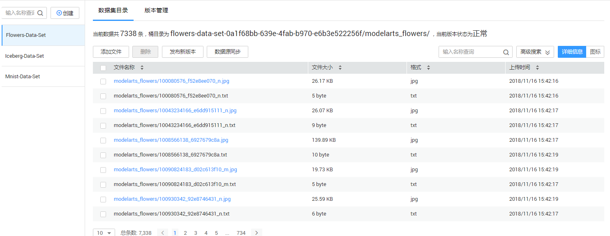
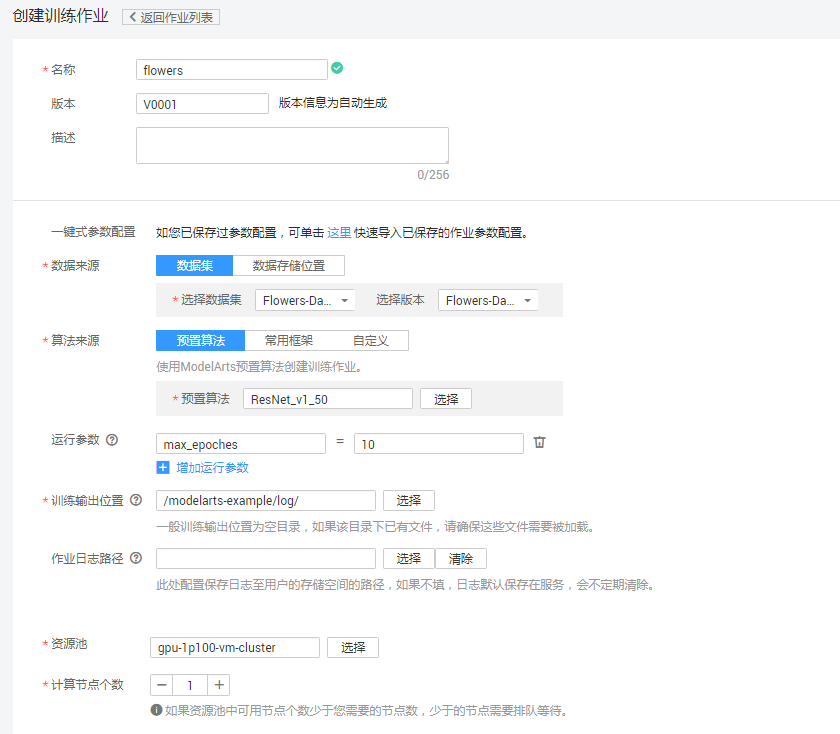
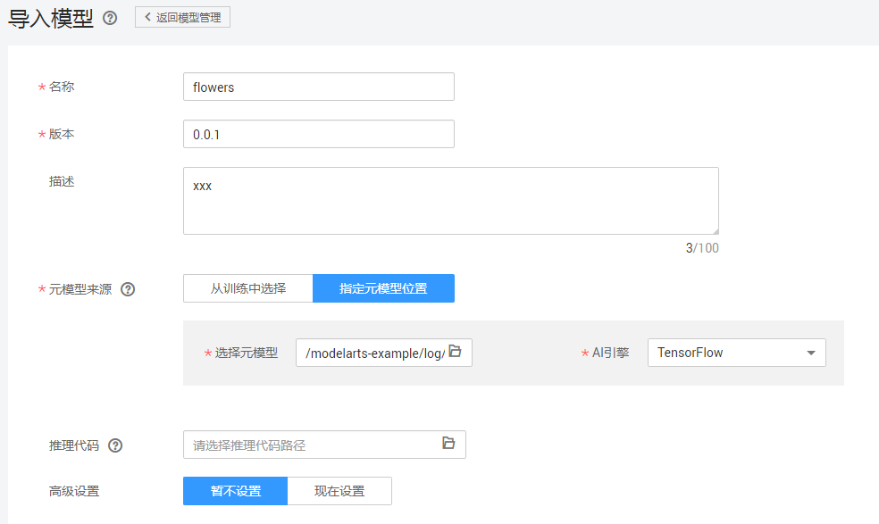
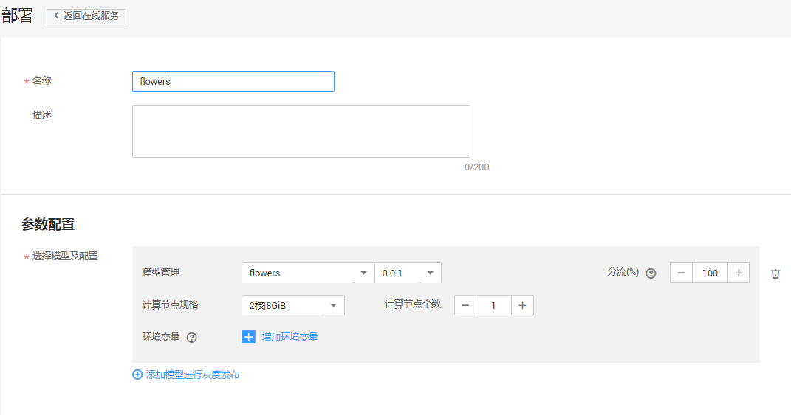
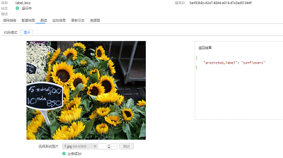

# 使用预置模型实现花卉图像分类应用

本文介绍在华为云ModelArts平台如何使用flowers数据集对预置的ResNet_v1\_50模型进行重训练，快速构建花卉图像分类应用。操作步骤分为4部分，分别是：

1.	**准备数据**：在ModelArts市场预置数据集中找到自动学习对应的flowers训练集，并根据该原始数据集生成自动学习可处理的数据集。。
2.	**训练模型**：使用flowers训练集，对ResNet_v1\_50模型重训练，得到新模型。
3.	**部署模型**：将得到的模型，部署为在线预测服务。
4.	**发起预测请求**：发起预测请求获取请求结果。

    注：如果是第一次使用ModelArts服务，在使用之前需要给服务添加访问密钥。可参考<a href="https://github.com/CalvinXKY/modelarts-example/blob/master/Using%20ModelArts%20to%20Create%20a%20Yunbao%20Detection%20Model/README.md">“服务配置”</a>。
### 1. 准备数据

通过ModelArts市场预置数据集创建自动学习所需数据集版本，操作步骤如下：

**步骤 1** &#160; &#160; 登录“ModelArts”管理控制台，单击左侧导航栏的“市场”。

**步骤 2** &#160; &#160; 切换到ModelArts市场的“数据集”页面，找到自动学习对应的花卉数据集“Flowers-Data-Set”。

**步骤 3** &#160; &#160; 进入到该预置花卉数据集的详情页面，执行“导入我的数据集操作”，页面会自动跳转到“数据管理>数据集”页面进行创建。

**步骤 4** &#160; &#160; 在“数据管理>数据集”页面查看直到花卉数据集创建完成，数据详细信息完全加载。

**步骤 5** &#160; &#160; 在数据集目录页面获取创建的花卉数据集的桶信息,请参考图6。

图6 数据集

### 2. 训练模型
接下来将使用训练集对预置的ResNet_v1\_50模型进行重训练获取新的模型，操作步骤如下：

**步骤 1**&#160; &#160; 返回“ModelArts”管理控制台界面。单击左侧导航栏的“训练作业”，进入“训练作业”界面。

**步骤 2**&#160; &#160;填写参数。“名称”和“描述”可以随意填写；“数据来源”请选择“数据集”，并选择Flowers\_Data\_Set；在“算法/预置算法”列表中找到名称为“ResNet\_v1\_50”的模型；“训练输出位置”请选择一个路径（s3://modelarts-example/log）用于保存输出模型和预测文件，参数确认无误后，单击“立即创建”完成训练作业创建。

注： “运行参数”可点击“增加运行参数”，增加参数max\_epoches=10；

    max_epoches：1个epoch代表整个数据集训练一遍，此处表示训练10个epoch，数值可更改，不填写时使用默认值(默认值100），epoches值越大训练时间越长。
   

图2 训练作业的参数配置

**步骤 3**&#160; &#160; 在模型训练的过程中或者完成后，通过创建TensorBoard作业查看一些参数的统计信息，如loss， accuracy等。在“训练作业”界面，点击TensorBoard，再点击“创建”按钮，参数“名称”可随意填写，“日志路径”请选择步骤3中“训练输出位置”参数中的路径(s3://modelarts-example/log)。

图3 创建tensorboard

训练作业完成后，即完成了模型训练过程。如有问题，可点击作业名称，进入作业详情界面查看训练作业日志信息。

**步骤 4**&#160; &#160; 当训练作业运行成功后，可以在创建训练作业选择的训练输出位置OBS路径下看到新的模型文件。

### 3. 部署模型

模型训练完成后，可以创建预测作业，将模型部署为在线预测服务，操作步骤如下：

**步骤 1**  &#160; &#160; 在“模型管理”界面，单击左上角的“导入”，参考图2填写参数。名称可随意填写，“元模型来源”选择“指定元模型位置”，“选择元模型”的路径与训练模型中“训练输出位置”保持一致(s3://modelarts-example/log)，“AI引擎”选择“TensorFlow”，“推理代码”可忽略。

图4 导入模型参数配置

**步骤 2**  &#160; &#160; 参数确认无误后，单击“立即创建”，完成模型创建。当模型状态为“正常”时，表示创建成功。单击部署-在线服务，创建预测服务，参考图5填写参数。

当模型状态为“正常”时，表示创建成功。单击部署-在线服务，创建预测服务。

图5 部署在线服务参数配置

### 4. 发起预测请求

完成模型部署后，在部署上线-在线服务界面可以看到已上线的预测服务名称，点击进入可以进行在线预测，如图6。

图6 在线服务测试

